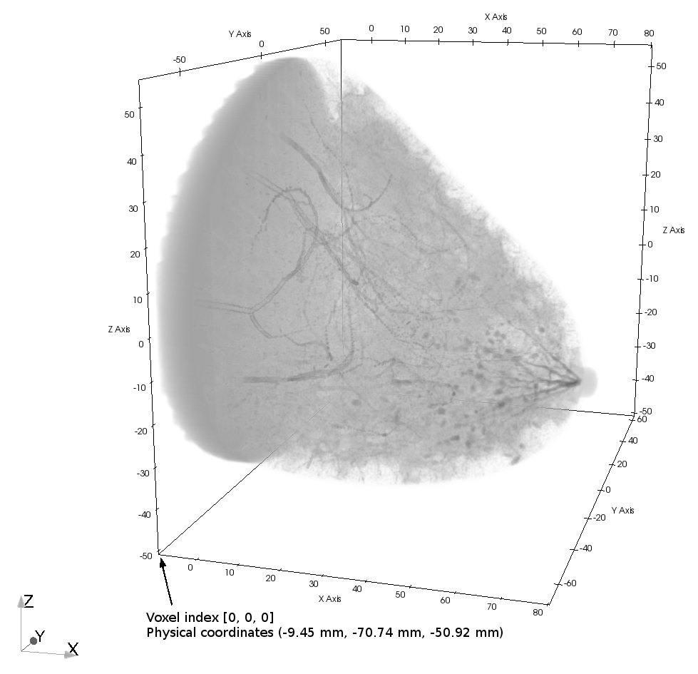

Geometry and Visualization
==========================

Visualization Software
----------------------

A variety of software is available for visualizing phantom data. Raw data can be read using any programming language, Python, Matlab, etc. Here are some tips.

* `Paraview <https://www.paraview.org>`_ can read ``.vti`` files and ``.mhd`` headers. To read the phantom using ``.mhd`` header the ``.raw.gz`` file must first be extracted with gunzip.
* When viewing phantoms in Paraview you may run into memory limitations. Uncompressed high resolution phantoms may exceed 8GB and cause Paraview to run slowly or crash. Slice view is more reliable than volume view for visualizing large phantoms in Paraview.
* Other software that may be useful for visualizing phantom files: `ImageJ <https://imagej.nih.gov/ij/>`_, `Amide <http://amide.sourceforge.net/>`_
* Large phantoms may cause memory problems and should be loading into memory directly as 8 bit integers when possible.
* Large phantoms may contain more than 2\ :sup:`32` voxels, causing problems in for loops. Use of 64 bit integer indexing variables may be necessary.

Coordinate System
-----------------

Each phantom has a physical coordinate system (millimeter units) and a voxel indexing scheme.  The following figure illustrates the connection between these two systems.

* The *x* coordinate (first voxel index) is the chest wall to nipple direction
* The *y* coordinate (second voxel index) is the lateral (left-right) direction
* The *z* coordinate (third voxel index) is the inferior-superior direction
* Voxel index [0, 0, 0] is noted in the figure in the most inferior transverse plane

The corresponding mhd header file for this phantom contains the following lines::

    Offset = -9.4500 -70.7366 -50.9244
    ElementSpacing = 0.1000 0.1000 0.1000
    DimSize = 899 1351 1068

This indicates the physical location of the voxel with index [0, 0, 0] is at physical location (-9.4500mm,  -70.7366mm, -50.9244mm). The total number of voxels in the x, y, and z dimensions are 899, 1351, and 1068 respectively. Each voxel is a 0.1 mm cube.
